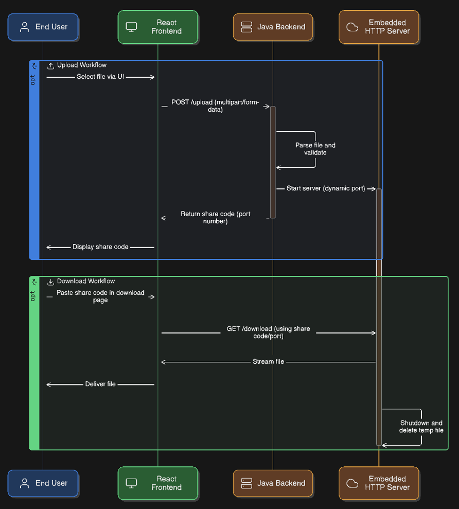
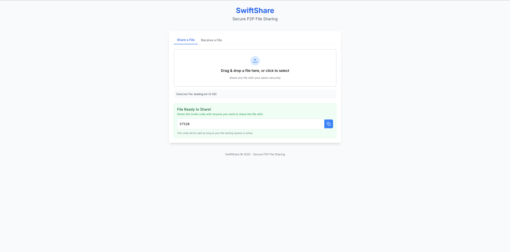
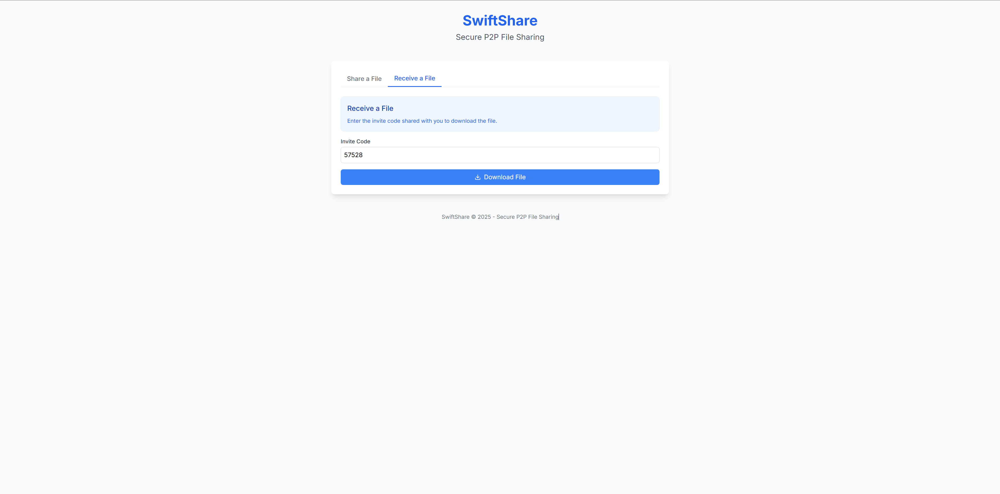

# SwiftShare: A Secure Peer-to-Peer File Sharing Platform

SwiftShare is a lightweight, full-stack **peer-to-peer (P2P) file sharing system**. Built with a robust **Java** backend and a **React** frontend, SwiftShare supports production-ready deployments via **Docker**, **Nginx**, and **PM2**. It enables high-performance file sharing using dynamic socket connections and embedded HTTP servers.

> **Note:** Web Application accessible via `http://3.110.36.133:80/`

---

## Features

* **Temporary File Hosting:** Backend spins up ephemeral file servers on dynamic ports (49152–65535) for each upload
* **Secure Upload & Download:** On each upload, a port is dynamically allocated to serve the file, which is used by the client during download
* **Manual Multipart Parsing:** Uploads handled through custom `multipart/form-data` parsing
* **Clean Teardown:** File servers auto-shutdown post-download using JVM shutdown hooks
* **Next.js Frontend:** Upload/download pages with responsive UX
* **Production-Grade Deployment:** Supports both Docker and PM2 + Nginx VPS-based deployment

---

## Tech Stack

* **Java 17** – Backend logic and embedded server handling
* **Next.js 14** – Frontend UI and routing
* **React** – Component-based architecture
* **Docker & Docker Compose** – Containerization and orchestration
* **Nginx** – Reverse proxy for backend/frontend routing
* **PM2** – VPS-based process monitoring

---

## System Architecture

### Backend

* **FileController.java** handles `/upload` and `/download` endpoints
* Upload parsing is implemented manually using boundary detection and stream processing
* On upload, a `FileSharer` starts an embedded HTTP server to host the file
* The file is deleted post-transfer via JVM shutdown hook

### Frontend

* **Upload Page:** Select and send file to backend → receive a shareable code (port number)
* **Download Page:** Paste code and download file in real-time
* Uses `NEXT_PUBLIC_API_URL` environment variable for dynamic backend targeting

### Deployment Layers

* **Docker:** Multi-stage builds for both backend and frontend
* **Docker Compose:** Orchestrates all containers with exposed port ranges
* **Nginx:** Proxies `/api/` to backend and all other routes to frontend
* **PM2 + VPS:** Runs backend and frontend as daemonized processes with persistent uptime and graceful restart

---

## Project Structure

```
SwiftShare/                      
├── Dockerfile.backend           # Dockerfile for backend
├── Dockerfile.frontend          # Dockerfile for frontend
├── docker-compose.yml           # Docker compose file to spin up containers for frontend, backend and nginx
├── nginx.conf                   # Nginx proxy config for docker compose setup
├── pom.xml                      # Maven configuration file
├── vps-setup.sh                 # VPS provisioning script
├── docker-setup.sh              # Docker build & run script
│
├── src/                         # Java Backend
│   └── main/java/p2p/
│       ├── App.java             # Main application entry point
│       ├── controller/
│       │   └── FileController.java
│       ├── service/
│       │   └── FileSharer.java
│       └── utils/
│           └── UploadUtils.java
│
└── ui/                          # React frontend app
    ├── src/app/
    │   ├── globals.css
    │   ├── layout.tsx
    │   └── page.tsx
    └── src/components/
        ├── FileDownload.tsx
        ├── FileUpload.tsx
        └── InviteCode.tsx
```

---

## Upload/Download Workflow

### Workflow Diagram

<p align="center">
  
</p>

### Process Steps

1. **Upload:**
   - User selects file → frontend sends it as `multipart/form-data` to `/upload`
   - Backend parses the file and starts a temporary embedded HTTP server
   - Server returns a direct download code (port number)

2. **Download:**
   - User pastes code → frontend fetches file directly from the allocated port
   - File streams in real-time; server shuts down and deletes file after transfer

---

## Deployment

### Docker Compose

```bash
# Build and run all services via Docker Compose
bash docker-setup.sh
```

### VPS with PM2 + Nginx

```bash
# Install dependencies and provision services
bash vps-setup.sh
```

---

## Demo Screenshots

### Upload Page

<p align="center">
  
</p>

### Download Page

<p align="center">
  
</p>

---

## Access Services

* **Web Application:** `http://<vps-ip>:80/` (reverse proxied via Nginx)
* **Frontend UI:** `http://<vps-ip>/`
* **Backend API:** `http://<vps-ip>/api/`

---
